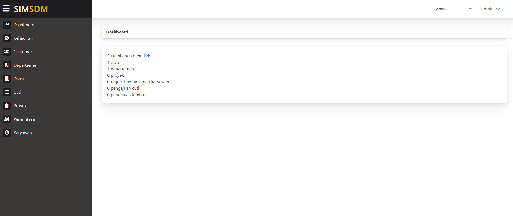

# SIMSDM
For AKPSI course final project. This system is build for company to manage their human resource and project. Some feature available on this system are:
* request employee from other department
* assign project and its manager
* create attendance reports
* create paid leave applications
* etc.

## Screenshot


To set up the project, you must do the following
- Clone this project, move to directory
```
git clone https://github.com/aminurmuda/simsdm.git
cd simsdm
```
- Install [Composer](https://getcomposer.org/).
- Install [Laravel](https://laravel.com/).
- Install NPM
```
sudo apt-get update
sudo apt-get install nodejs
sudo apt-get install npm
```
- Run laravel
```
php artisan serve
```

open http://localhost:8000/register to register account
